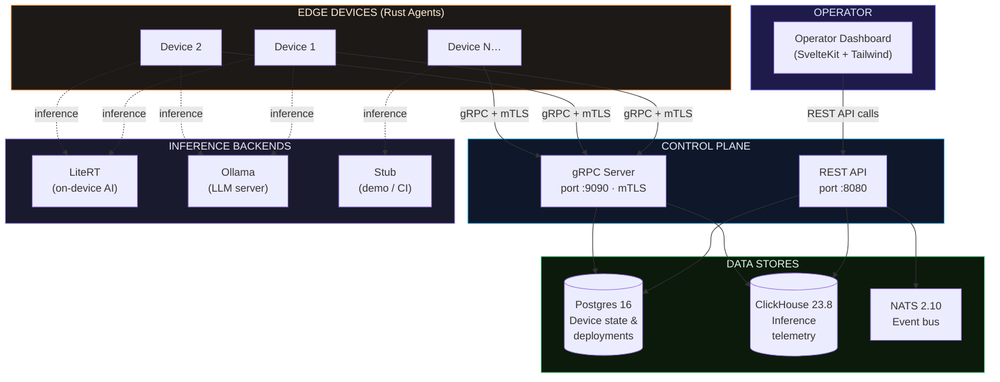
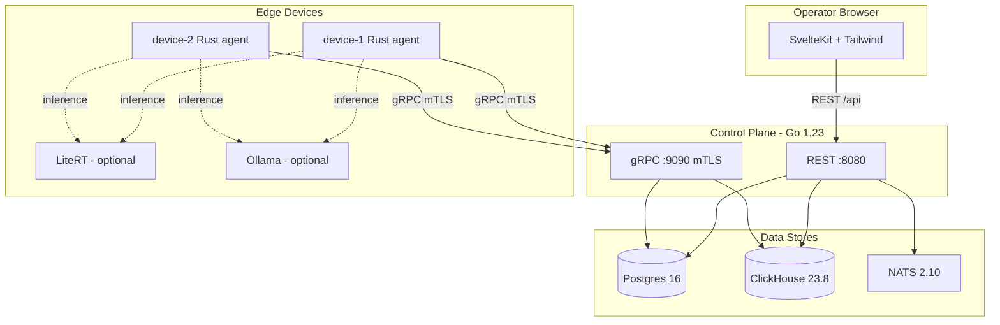

# Cami Fleet

[](https://github.com/madosh/EDGE-LLM/actions/workflows/ci.yml)
[](LICENSE)
[](https://go.dev)
[](https://www.rust-lang.org)
[](https://kit.svelte.dev)

A control plane and device agent system for managing **edge AI deployments at scale**.

Deploy models to devices by tag, watch each device download, verify the SHA-256, load the model, and stream live inference telemetry — all from an operator dashboard.



---

## Features

- **Tag-based deployment** — push models to devices matching label selectors (e.g. `location=barcelona`)
- **Content-addressed artifacts** — SHA-256 verified downloads; agents refuse tampered weights
- **mTLS device auth** — gRPC over TLS 1.3 with mutual certificate authentication
- **Multi-backend inference** — pluggable runtime: Google LiteRT, Ollama, or stub mode
- **Live telemetry** — per-device tokens/sec, TTFT, memory streamed to ClickHouse
- **Offline detection** — heartbeat watchdog marks devices offline after 30s
- **Event bus** — NATS JetStream for cross-service device events
- **Operator UI** — SvelteKit dashboard with fleet overview, deploy form, and device detail

---

## Architecture



---

## Quick Start

```bash
git clone https://github.com/madosh/EDGE-LLM.git
cd EDGE-LLM
cp .env.example .env
docker compose up --build
```

Open **http://localhost:5173** — two simulated devices appear within ~60 seconds. The architecture supports N devices; the demo ships two by default.

### Deploy a model

```bash
SHA=$(cat artifacts/sample-gemma-4-e2b.tar.gz.sha256)

curl -s -X POST http://localhost:8080/api/deployments \
  -H "X-Api-Key: changeme" \
  -H "Content-Type: application/json" \
  -d "{
    \"model_id\": \"gemma-4-e2b\",
    \"artifact_url\": \"http://control-plane:8080/artifacts/sample-gemma-4-e2b.tar.gz\",
    \"artifact_sha256\": \"$SHA\",
    \"tag_selector\": {\"location\": \"barcelona\"}
  }" | jq .
```

Each device cycles through `pending → downloading → verifying → running` within seconds.

---

## Inference Backends

The agent supports three runtime backends, selected via `RUNTIME_BACKEND` or auto-detected:

| Backend | Env Var | Best for |
|---------|---------|----------|
| **LiteRT** | `LITERT_URL` | Edge devices with NPU/GPU (Pixel, MediaTek, Qualcomm) |
| **Ollama** | `OLLAMA_URL` | x86/ARM servers with CUDA or CPU inference |
| **Stub** | *(default)* | CI, demos, development without a runtime |

---

## Project Structure

```
├── .github/workflows/ci.yml    CI pipeline (Go, Rust, Web, Docker)
├── docker-compose.yml           Full stack orchestration
├── Makefile                     Dev shortcuts
├── .env.example                 Configuration template
│
├── control-plane/               Go 1.23 — REST + gRPC server
│   ├── proto/device.proto       AgentService definition
│   ├── cmd/server/main.go       Entry point + config
│   └── internal/
│       ├── api/grpc/            gRPC server (register, heartbeat, deploy, telemetry)
│       ├── api/rest/            REST API (devices, deployments, artifacts)
│       ├── store/postgres/      Device state + deployments
│       ├── store/clickhouse/    Time-series telemetry
│       └── events/nats/         Event pub/sub
│
├── agent/                       Rust — edge device agent
│   └── src/
│       ├── main.rs              Register → heartbeat → watch → deploy
│       ├── config.rs            CLI/env configuration
│       ├── grpc_client.rs       mTLS gRPC connection
│       ├── model_runtime.rs     Multi-backend runtime (LiteRT, Ollama, Stub)
│       └── telemetry.rs         Streaming telemetry loop
│
├── web/                         SvelteKit — operator dashboard
│   └── src/routes/
│       ├── +page.svelte         Fleet overview
│       ├── deployments/         Deploy form + history
│       └── devices/[id]/        Device detail + telemetry
│
├── monitoring/                  Prometheus + Grafana dashboards
├── scripts/gen-certs.sh         mTLS certificate generation
├── artifacts/                   Model artifacts (generated at runtime)
└── docs/architecture.html       Interactive architecture documentation
```

---

## Configuration

| Variable | Default | Description |
|----------|---------|-------------|
| `CAMI_API_KEY` | `changeme` | API key for REST endpoints and web UI |
| `ARTIFACTS_BASE_URL` | `http://control-plane:8080` | Base URL for artifact downloads |
| `RUNTIME_BACKEND` | *(auto-detect)* | Force backend: `litert`, `ollama`, or `stub` |
| `LITERT_URL` | *(empty)* | LiteRT server endpoint |
| `OLLAMA_URL` | *(empty)* | Ollama API endpoint for inference |
| `DEVICE_NAME` | `device-001` | Unique device name |
| `DEVICE_LABELS` | *(empty)* | Comma-separated `key=value` labels |
| `CONTROL_PLANE_URL` | `https://localhost:9090` | gRPC endpoint |
| `CERT_DIR` | `/certs` | mTLS certificate directory |

---

## Development

### Prerequisites

| Tool | Version |
|------|---------|
| Docker + Compose | v2+ |
| Go | 1.23+ |
| Rust | stable |
| Node.js | 20+ |

### Running tests

```bash
# Go
cd control-plane && go test ./...

# Rust
cd agent && cargo test

# Web
cd web && npm test
```

---

## Service Ports

| Service | Port | Protocol |
|---------|------|----------|
| Web UI | 5173 (dev) / 3000 (prod) | HTTP |
| REST API | 8080 | HTTP |
| Prometheus Metrics | 8080/metrics | HTTP |
| gRPC | 9090 | gRPC / mTLS |
| Prometheus | 9091 | HTTP |
| Grafana | 3001 | HTTP |
| Postgres | 5432 | TCP |
| ClickHouse | 8123 / 9000 | HTTP / TCP |
| NATS | 4222 | TCP |
| LiteRT | 8000 | HTTP |
| Ollama | 11434 | HTTP |

---

## Monitoring & Observability

The stack includes a full observability layer:

- **Operator Dashboard** (`http://localhost:5173/monitoring`) — fleet-wide telemetry with live charts, device performance table, and alert banners
- **Prometheus** (`http://localhost:9091`) — scrapes control-plane metrics every 15s
- **Grafana** (`http://localhost:3001`) — pre-provisioned dashboards for fleet overview, inference performance, and control-plane health (admin/changeme)
- **Server-Sent Events** (`/api/events/stream`) — real-time push from NATS to browser
- **Webhook Alerts** — optional: set `WEBHOOK_URL` in `.env` to send device-offline and deployment-failed alerts to Slack/Discord/any endpoint

### Exposed Prometheus metrics

| Metric | Type | Description |
|--------|------|-------------|
| `cami_devices_total{status}` | Gauge | Devices by online/offline status |
| `cami_grpc_streams_active` | Gauge | Active gRPC telemetry streams |
| `cami_deployments_total{state}` | Gauge | Deployments by state |
| `cami_rest_request_duration_seconds` | Histogram | REST API latency |
| `cami_telemetry_inserts_total` | Counter | ClickHouse telemetry inserts |

---

## Contributing

See [CONTRIBUTING.md](CONTRIBUTING.md) for development setup, code style, and PR guidelines.

## License

[MIT](LICENSE)
