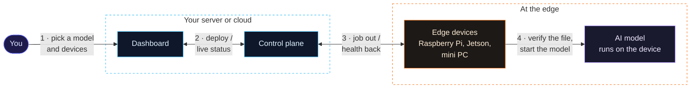
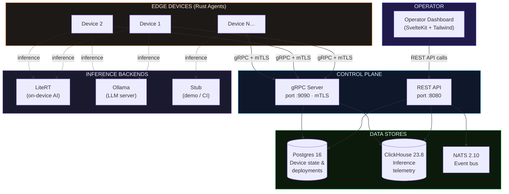
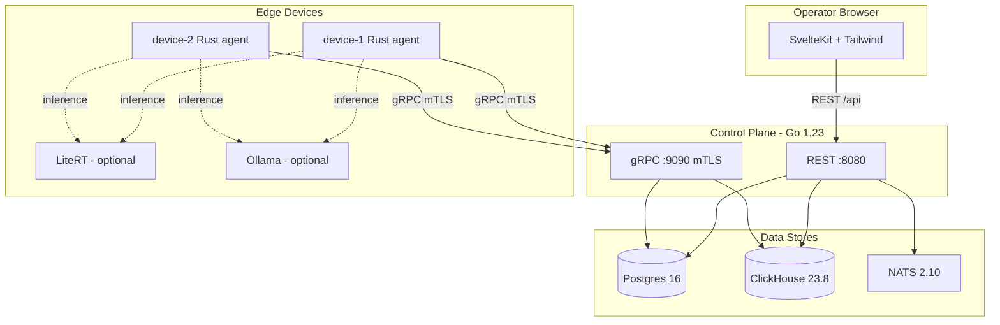

# Cami Fleet

[](https://github.com/madosh/EDGE-LLM/actions/workflows/ci.yml)
[](LICENSE)
[](https://go.dev)
[](https://www.rust-lang.org)
[](https://kit.svelte.dev)

A control plane and device agent system for managing **edge AI deployments at scale**.

Deploy models to devices by tag, watch each device download, verify the SHA-256, load the model, and stream live inference telemetry — all from an operator dashboard.

## How it works



1. **You choose** a model and which devices should get it, for example "every device in Barcelona".
2. **The control plane** keeps track of every device and deployment, and shows you live status on the dashboard.
3. **It sends the job** to each matching device over a secure connection, and each device reports its health back.
4. **Each device** downloads the model, checks it is exactly the file you published (by its SHA-256 fingerprint), and runs it locally. Answers are generated on the device, with no cloud call.

### Detailed view



---

## Features

- **Tag-based deployment** — push models to devices matching label selectors (e.g. `location=barcelona`)
- **Verified artifacts, verified execution** — the agent streams each artifact to disk while hashing it, keeps it only if the SHA-256 matches, and the runtime loads *that exact file*
- **Per-device mTLS identity** — gRPC over TLS 1.3; each device has its own certificate, and the control plane checks every request against the certificate's name
- **Real on-device inference** — Google [LiteRT-LM](https://github.com/google-ai-edge/LiteRT-LM) (`litert-lm serve`), Ollama, or a stub for demos and CI
- **Honest telemetry** — time to first token from the first streamed token, decode speed from real token counts; a failing runtime shows as `error`, not as made-up numbers
- **Offline detection** — heartbeat watchdog marks devices offline after 30s
- **Event bus** — NATS for device and deployment events
- **Operator UI** — SvelteKit dashboard with fleet overview, deploy form, and device detail

---

## Architecture



---

## Quick Start

```bash
git clone https://github.com/madosh/EDGE-LLM.git
cd EDGE-LLM
cp .env.example .env
docker compose up --build
```

Open **http://localhost:5173** — two simulated devices appear within ~60 seconds. They run the **stub** backend, so the quick start works offline with no model download. For real inference, see [Real on-device inference with LiteRT-LM](#real-on-device-inference-with-litert-lm).

Requires Docker Engine 26+ and Compose 2.23+ (each container mounts only its own certificate directory, using volume `subpath`).

### Deploy a model

```bash
SHA=$(cat artifacts/sample-gemma-4-e2b.tar.gz.sha256)

curl -s -X POST http://localhost:8080/api/deployments \
  -H "X-Api-Key: changeme" \
  -H "Content-Type: application/json" \
  -d "{
    \"model_id\": \"gemma-4-e2b\",
    \"artifact_url\": \"http://control-plane:8080/artifacts/sample-gemma-4-e2b.tar.gz\",
    \"artifact_sha256\": \"$SHA\",
    \"tag_selector\": {\"location\": \"barcelona\"}
  }" | jq .
```

Each device cycles through `pending → downloading → verifying → running` within seconds. The sample artifact is a placeholder file, so only the stub backend can "run" it; a real runtime rejects it.

---

## Inference Backends

The agent supports three runtime backends, selected via `RUNTIME_BACKEND` or auto-detected (LiteRT > Ollama > Stub):

| Backend | Env Var | Runs the verified file by | Best for |
|---------|---------|---------------------------|----------|
| **LiteRT-LM** | `LITERT_URL`, `LITERT_ACCELERATOR` | passing its absolute path to `litert-lm serve` | Edge devices: Raspberry Pi 5, Linux ARM/x86, CPU/GPU/NPU |
| **Ollama** | `OLLAMA_URL` | uploading it as a blob (`/api/blobs/sha256:…`) and creating the model from that digest | x86/ARM servers with CUDA or CPU |
| **Stub** | *(default)* | — (synthetic telemetry, labelled `stub`) | CI, demos, development without a runtime |

Every artifact is stored under its SHA-256 in `MODEL_CACHE_DIR`. A cached file is re-hashed before each use, so tampering on disk is caught too.

### Real on-device inference with LiteRT-LM

[LiteRT-LM](https://github.com/google-ai-edge/LiteRT-LM) is Google's on-device LLM runtime; it powers on-device GenAI in Chrome, Chromebook Plus and Pixel Watch. Its CLI ships `litert-lm serve`, an OpenAI-compatible server that runs `.litertlm` models on Linux, macOS, Windows and Raspberry Pi, with CPU, GPU and NPU backends. The agent uses it like this:

1. Download the artifact, hashing while streaming; keep it only if the SHA-256 matches.
2. Ask `litert-lm serve` to load `"<absolute path>,<accelerator>"` — the server accepts a file path as the model, so the verified bytes are what runs.
3. Every `PROBE_INTERVAL_SECS`, stream a short completion: time to first token is when the first token arrives; decode speed comes from the server's `usage.completion_tokens`.

**On a real device** (e.g. Raspberry Pi 5):

```bash
uv tool install litert-lm
litert-lm serve                       # 127.0.0.1:9379
RUNTIME_BACKEND=litert DEVICE_NAME=pi-1 ./cami-agent
```

**With Compose**, put a `.litertlm` model and its digest in `artifacts/`, then start the `litert` profile:

```bash
# e.g. gemma-4-E4B-it.litertlm from https://huggingface.co/litert-community/gemma-4-E4B-it-litert-lm
sha256sum artifacts/gemma-4-E4B-it.litertlm > artifacts/gemma-4-E4B-it.litertlm.sha256
docker compose --profile litert up --build
```

Deploy it to `{"runtime": "litert"}` with the digest from the `.sha256` file. (`--profile ollama` does the same for a GGUF model on Ollama.)

> For LiteRT running inside an Android app — the runtime loading a model on a phone — see
> [`examples/litert-android`](examples/litert-android/README.md).

---

## Examples

| Example | Stack | What it shows |
|---------|-------|---------------|
| [`examples/litert-android`](examples/litert-android/README.md) | Android · Kotlin · Compose | **Google LiteRT on-device**: MobileNet image classification (`Interpreter` API + GPU delegate) and Gemma text generation (LiteRT-LM). 100% offline, no `INTERNET` permission. |

---

## Project Structure

```
├── .github/workflows/ci.yml    CI pipeline (Go, Rust, Web, Docker)
├── docker-compose.yml           Full stack orchestration
├── Makefile                     Dev shortcuts
├── .env.example                 Configuration template
│
├── control-plane/               Go 1.23 — REST + gRPC server
│   ├── proto/device.proto       AgentService definition
│   ├── cmd/server/main.go       Entry point + config
│   └── internal/
│       ├── api/grpc/            gRPC server (register, heartbeat, deploy, telemetry)
│       ├── api/rest/            REST API (devices, deployments, artifacts)
│       ├── store/postgres/      Device state + deployments
│       ├── store/clickhouse/    Time-series telemetry
│       └── events/nats/         Event pub/sub
│
├── agent/                       Rust — edge device agent
│   └── src/
│       ├── main.rs              Register → heartbeat → watch → deploy
│       ├── config.rs            CLI/env configuration
│       ├── grpc_client.rs       mTLS gRPC connection
│       ├── model_runtime.rs     Multi-backend runtime (LiteRT, Ollama, Stub)
│       └── telemetry.rs         Streaming telemetry loop
│
├── web/                         SvelteKit — operator dashboard
│   └── src/routes/
│       ├── +page.svelte         Fleet overview
│       ├── deployments/         Deploy form + history
│       └── devices/[id]/        Device detail + telemetry
│
├── monitoring/                  Prometheus + Grafana dashboards
├── scripts/gen-certs.sh         mTLS certificate generation
├── artifacts/                   Model artifacts (generated at runtime)
└── docs/architecture.html       Interactive architecture documentation
```

---

## Configuration

| Variable | Default | Description |
|----------|---------|-------------|
| `CAMI_API_KEY` | `changeme` | API key for REST endpoints and web UI |
| `ARTIFACTS_BASE_URL` | `http://control-plane:8080` | Base URL for artifact downloads |
| `RUNTIME_BACKEND` | *(auto-detect)* | Force backend: `litert`, `ollama`, or `stub` |
| `LITERT_URL` | *(empty; `http://127.0.0.1:9379` when `litert` is forced)* | `litert-lm serve` endpoint |
| `LITERT_ACCELERATOR` | `cpu` | LiteRT-LM backend: `cpu`, `gpu`, or `npu` |
| `OLLAMA_URL` | *(empty)* | Ollama API endpoint for inference |
| `MODEL_CACHE_DIR` | `/var/lib/cami/models` | Verified artifacts, named by SHA-256 |
| `PROBE_INTERVAL_SECS` | `30` | Seconds between telemetry probes (each runs a short real generation) |
| `DEVICE_NAME` | `device-001` | Unique device name; must equal the CN of the device's certificate |
| `DEVICE_LABELS` | *(empty)* | Comma-separated `key=value` labels |
| `CONTROL_PLANE_URL` | `https://localhost:9090` | gRPC endpoint |
| `CERT_DIR` | `/certs` | This device's `ca.crt`, `device.crt`, `device.key` |

> [!WARNING]
> **Demo defaults are not production settings.** This repository ships
> throwaway credentials so `docker compose up` works with no setup: the API key
> is `changeme`, Postgres and ClickHouse both use `cami`/`cami`, and the mTLS
> certificates are self-signed by `scripts/gen-certs.sh`. They grant access to
> nothing outside a local container. Before exposing any part of this stack to a
> network you don't control, read [SECURITY.md](SECURITY.md) and replace every
> default.

---

## Development

### Prerequisites

| Tool | Version |
|------|---------|
| Docker + Compose | v2+ |
| Go | 1.23+ |
| Rust | stable |
| Node.js | 20+ |

### Running tests

```bash
# Go
cd control-plane && go test ./...

# Rust
cd agent && cargo test

# Web
cd web && npm test
```

---

## Service Ports

| Service | Port | Protocol |
|---------|------|----------|
| Web UI | 5173 (dev) / 3000 (prod) | HTTP |
| REST API | 8080 | HTTP |
| Prometheus Metrics | 8080/metrics | HTTP |
| gRPC | 9090 | gRPC / mTLS |
| Prometheus | 9091 | HTTP |
| Grafana | 3001 | HTTP |
| Postgres | 5432 | TCP |
| ClickHouse | 8123 / 9000 | HTTP / TCP |
| NATS | 4222 | TCP |
| LiteRT | 8000 | HTTP |
| Ollama | 11434 | HTTP |

---

## Monitoring & Observability

The stack includes a full observability layer:

- **Operator Dashboard** (`http://localhost:5173/monitoring`) — fleet-wide telemetry with live charts, device performance table, and alert banners
- **Prometheus** (`http://localhost:9091`) — scrapes control-plane metrics every 15s
- **Grafana** (`http://localhost:3001`) — pre-provisioned dashboards for fleet overview, inference performance, and control-plane health (admin/changeme)
- **Server-Sent Events** (`/api/events/stream`) — real-time push from NATS to browser
- **Webhook Alerts** — optional: set `WEBHOOK_URL` in `.env` to send device-offline and deployment-failed alerts to Slack/Discord/any endpoint

### Exposed Prometheus metrics

| Metric | Type | Description |
|--------|------|-------------|
| `cami_devices_total{status}` | Gauge | Devices by online/offline status |
| `cami_grpc_streams_active` | Gauge | Active gRPC telemetry streams |
| `cami_deployments_total{state}` | Gauge | Deployments by state |
| `cami_rest_request_duration_seconds` | Histogram | REST API latency |
| `cami_telemetry_inserts_total` | Counter | ClickHouse telemetry inserts |

---

## Contributing

See [CONTRIBUTING.md](CONTRIBUTING.md) for development setup, code style, and PR guidelines.

## Known limitations

This is a reference design. What it does not do yet:

- **One control-plane instance.** Live deployment streams are tracked in memory; a second instance would not see devices connected to the first.
- **Targeting happens once.** A deployment's selector is matched when it is created; a device that joins later does not receive it. There is no desired-state reconciliation, staged rollout, or rollback yet.
- **No model manifest.** Devices report CPU architecture and OS, but deployments do not yet declare memory, accelerator or runtime requirements, so an unsuitable device fails at load time rather than being skipped.
- **Telemetry is a probe.** Numbers come from the agent's own short request against the runtime every `PROBE_INTERVAL_SECS`, not from real user traffic.
- **Some endpoints are open.** `/metrics` and the dashboard's event stream do not require the API key; keep the control plane on a private network.

## Security

This is a reference project, not a hardened product. See [SECURITY.md](SECURITY.md)
for how to report a vulnerability privately and what to change before running it
on an untrusted network.

## License

[MIT](LICENSE)
