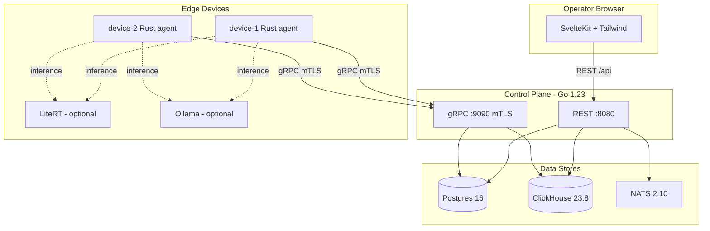

# Cami Fleet

[](https://github.com/<your-org>/cami-fleet/actions/workflows/ci.yml)
[](LICENSE)
[](https://go.dev)
[](https://www.rust-lang.org)

A control plane and device agent system for managing **edge AI deployments at scale**.

Deploy a model to devices by tag, watch each device download, verify the SHA-256, load the model, and stream live inference telemetry — all from an operator dashboard.

```
Operator dashboard  ──REST──▶  Go control plane  ──gRPC/mTLS──▶  Rust edge agents
                                   │                                   │
                              Postgres + ClickHouse + NATS        LiteRT | Ollama | Stub
```

---

## Features

- **Tag-based deployment** — push models to devices matching label selectors (e.g. `location=barcelona`)
- **Content-addressed artifacts** — SHA-256 verified downloads; agents refuse tampered weights
- **mTLS device auth** — gRPC over TLS 1.3 with mutual certificate authentication
- **Multi-backend inference** — pluggable runtime: Google LiteRT, Ollama, or stub mode
- **LiteRT edge AI** — Google's on-device runtime with NPU/GPU acceleration and Gemini-compatible API
- **Ollama support** — full Ollama integration for real tps/ttft/memory metrics
- **Stub mode** — works without a GPU; synthetic telemetry for demos and CI
- **Live telemetry** — per-device tokens/sec, TTFT, memory streamed to ClickHouse
- **Offline detection** — heartbeat watchdog marks devices offline after 30s
- **Event bus** — NATS JetStream for cross-service device events
- **Operator UI** — SvelteKit dashboard with fleet overview, deploy form, and device detail

---

## Architecture



---

## Quick Start

```bash
git clone https://github.com/<your-org>/cami-fleet.git
cd cami-fleet
cp .env.example .env
docker compose up --build
```

Open **http://localhost:5173** — two simulated devices appear within ~60 seconds.

### Deploy a model

Using the UI: go to the **Deployments** page, select the artifact, set tag selector
to `location=barcelona`, and click **Deploy**.

Using curl:

```bash
SHA=$(cat artifacts/sample-gemma-4-e2b.tar.gz.sha256)

curl -s -X POST http://localhost:8080/api/deployments \
  -H "X-Api-Key: changeme" \
  -H "Content-Type: application/json" \
  -d "{
    \"model_id\": \"gemma-4-e2b\",
    \"artifact_url\": \"http://control-plane:8080/artifacts/sample-gemma-4-e2b.tar.gz\",
    \"artifact_sha256\": \"$SHA\",
    \"tag_selector\": {\"location\": \"barcelona\"}
  }" | jq .
```

Each device cycles through `pending → downloading → verifying → running` within seconds.

---

## Inference Backends

The agent supports three runtime backends, selected via `RUNTIME_BACKEND` or auto-detected from URL env vars (priority: LiteRT > Ollama > Stub):

| Backend | Env Var | Best for |
|---------|---------|----------|
| **LiteRT** | `LITERT_URL` | Edge devices with NPU/GPU (Pixel, MediaTek, Qualcomm) |
| **Ollama** | `OLLAMA_URL` | x86/ARM servers with CUDA or CPU inference |
| **Stub** | *(default)* | CI, demos, development without a runtime |

---

### Running with Google LiteRT

[LiteRT-LM](https://ai.google.dev/edge/litert) is Google's edge-optimized inference runtime with NPU/GPU acceleration and a Gemini-compatible REST API.

1. Uncomment the `litert` service in `docker-compose.yml`
2. Uncomment `LITERT_URL` and `LITERT_MODEL` in the device services
3. Restart:

```bash
docker compose up --build
```

The agent connects to `lit serve` via its Gemini-compatible REST API and streams real inference telemetry. Supported models:

| Model | Size | Device target |
|-------|------|---------------|
| `gemma3-1b` | ~1 GB | Mobile, RPi 5 |
| `gemma3-4b` | ~3 GB | Jetson, high-end mobile |

For standalone use (without Docker):

```bash
pip install litert-lm
lit serve --model gemma3-1b --port 8000
# then set LITERT_URL=http://localhost:8000 for the agent
```

---

### Running with a Real LLM (Ollama)

By default, devices run in **stub mode** with synthetic metrics. To enable real inference:

1. Uncomment the `ollama` service in `docker-compose.yml`
2. Uncomment `OLLAMA_URL` in the device services
3. Restart:

```bash
docker compose up --build
```

The agent will pull the model via Ollama's API and stream real inference metrics
(tokens/sec, time-to-first-token, GPU memory). Any Ollama-compatible model works:

| Model | Size | Good for |
|-------|------|----------|
| `tinyllama:1.1b` | 637 MB | Fastest, CI/testing |
| `gemma3:1b` | 815 MB | Google Gemma, balanced |
| `phi3:mini` | 2.3 GB | Microsoft, best quality/size |
| `gemma3:4b` | 3.3 GB | Needs 8GB+ RAM |

For **GPU acceleration**, add to the Ollama service in compose:

```yaml
deploy:
  resources:
    reservations:
      devices:
        - capabilities: [gpu]
```

---

## Project Structure

```
cami-fleet/
├── .github/workflows/ci.yml    CI pipeline (Go, Rust, Web, Docker)
├── docker-compose.yml           Full stack orchestration
├── Makefile                     Dev shortcuts
├── .env.example                 Configuration template
│
├── control-plane/               Go 1.23 — REST + gRPC server
│   ├── proto/device.proto       AgentService definition
│   ├── cmd/server/main.go       Entry point + config
│   └── internal/
│       ├── api/grpc/            gRPC server (register, heartbeat, deploy, telemetry)
│       ├── api/rest/            REST API (devices, deployments, artifacts)
│       ├── store/postgres/      Device state + deployments
│       ├── store/clickhouse/    Time-series telemetry
│       └── events/nats/         Event pub/sub
│
├── agent/                       Rust — edge device agent
│   └── src/
│       ├── main.rs              Register → heartbeat → watch → deploy
│       ├── config.rs            CLI/env configuration
│       ├── grpc_client.rs       mTLS gRPC connection
│       ├── model_runtime.rs     Multi-backend runtime (LiteRT, Ollama, Stub)
│       └── telemetry.rs         Streaming telemetry loop
│
├── web/                         SvelteKit — operator dashboard
│   └── src/routes/
│       ├── +page.svelte         Fleet overview
│       ├── deployments/         Deploy form + history
│       └── devices/[id]/        Device detail + telemetry
│
├── scripts/gen-certs.sh         mTLS certificate generation
├── artifacts/                   Model artifacts (generated at runtime)
└── docs/architecture.html       Interactive architecture documentation
```

---

## Configuration

| Variable | Default | Description |
|----------|---------|-------------|
| `CAMI_API_KEY` | `changeme` | API key for REST endpoints and web UI |
| `ARTIFACTS_BASE_URL` | `http://control-plane:8080` | Base URL for artifact downloads (as seen by agents) |
| `RUNTIME_BACKEND` | *(auto-detect)* | Force backend: `litert`, `ollama`, or `stub` |
| `LITERT_URL` | *(empty)* | LiteRT server endpoint (e.g. `http://litert:8000`) |
| `LITERT_MODEL` | *(deployment model_id)* | Model name for LiteRT's `lit serve` |
| `OLLAMA_URL` | *(empty)* | Ollama API endpoint for inference |
| `DEVICE_NAME` | `device-001` | Unique device name |
| `DEVICE_LABELS` | *(empty)* | Comma-separated `key=value` labels |
| `CONTROL_PLANE_URL` | `https://localhost:9090` | gRPC endpoint |
| `CERT_DIR` | `/certs` | mTLS certificate directory |

---

## Development

### Prerequisites

| Tool | Version |
|------|---------|
| Docker + Compose | v2+ |
| Go | 1.23+ |
| Rust | stable |
| Node.js | 20+ |

### Running tests

```bash
# Go
cd control-plane && go test ./...

# Rust
cd agent && cargo test

# Web
cd web && npm test
```

### Code quality

```bash
# Go
cd control-plane && golangci-lint run

# Rust
cd agent && cargo fmt --check && cargo clippy -- -D warnings

# Web
cd web && npm run lint && npm run check
```

---

## Telemetry Schema (ClickHouse)

```sql
CREATE TABLE telemetry (
    device_id String,
    model_id  String,
    tps       Float32,   -- tokens/second
    ttft_ms   Float32,   -- time-to-first-token (ms)
    mem_mb    Float32,   -- model memory (MB)
    status    String,    -- idle | loading | running
    ts        DateTime
) ENGINE = MergeTree()
ORDER BY (device_id, ts)
TTL ts + INTERVAL 7 DAY;
```

---

## Service Ports

| Service | Port | Protocol |
|---------|------|----------|
| Web UI | 5173 (dev) / 3000 (prod) | HTTP |
| REST API | 8080 | HTTP |
| gRPC | 9090 | gRPC / mTLS |
| Postgres | 5432 | TCP |
| ClickHouse | 8123 / 9000 | HTTP / TCP |
| NATS | 4222 | TCP |
| LiteRT | 8000 | HTTP |
| Ollama | 11434 | HTTP |

---

## Contributing

See [CONTRIBUTING.md](CONTRIBUTING.md) for development setup, code style, and PR guidelines.

## License

[MIT](LICENSE)
